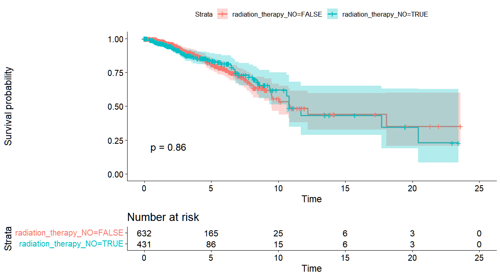
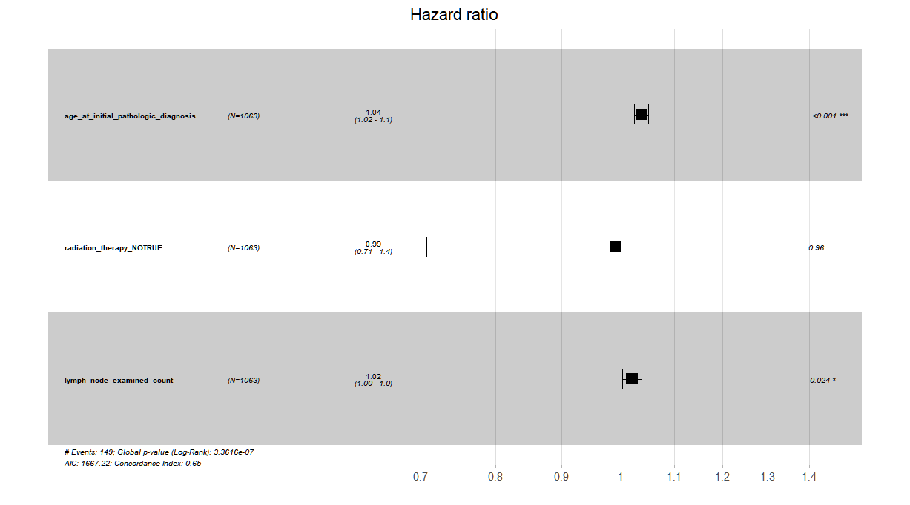

# Survival Analysis of Breast Cancer Patients Using Cox Proportional Hazards Models in R

## Objective
...

This project explores survival outcomes among breast cancer patients from the TCGA-BRCA dataset using Kaplan–Meier estimation and Cox proportional hazards regression models.


## Methods
...

- Exploratory Data Analysis (EDA)
- Missing data inspection
- Kaplan–Meier survival curves
- Log-rank test
- Cox proportional hazards regression
- Hazard ratio interpretation
- Proportional hazards assumption testing
- Publication-style survival visualizations

## Technologies
...

* R
* survival
* survminer
* tidyverse
* ggplot2


## Dataset
...

The analysis was performed using the TCGA-BRCA (The Cancer Genome Atlas Breast Cancer) clinical dataset containing survival outcomes and clinical characteristics of 1,063 breast cancer patients.
Source: TCGA-BRCA clinical data obtained from Kaggle.

## Key Results
...

* Age at diagnosis was significantly associated with increased mortality risk (HR = 1.04, p < 0.001).
* Lymph node examined count was associated with poorer survival outcomes (HR = 1.02, p = 0.024).
* Radiation therapy status was not significantly associated with overall survival after covariate adjustment (HR = 0.99, p = 0.96).
* No violations of the proportional hazards assumption were detected (global test p = 0.75).

## Kaplan–Meier Survival Curve



## Cox Model Forest Plot



## Repository Structure
...

```text
scripts/
├── 01_data_cleaning.R
├── 02_kaplan_meier.R
└── 03_cox_model.R

outputs/
└── figures/

README.md
```

